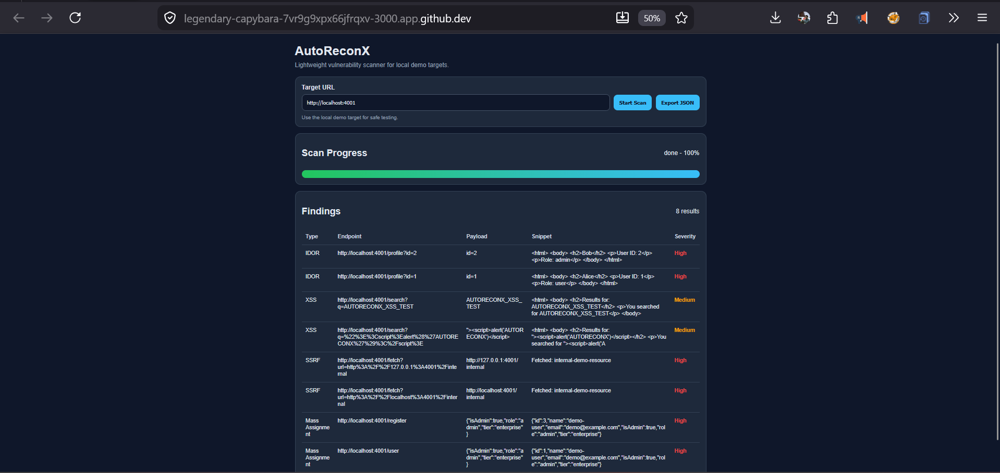

# AutoReconX

Lightweight vulnerability scanner for both online/local targets.


## Overview

AutoReconX is a lightweight web-based scanner built for safe local testing. It includes a demo target so users can simulate a judging environment and verify the scanner workflow without using external systems.

## Interface



## Online Version
[https://autoreconx.onrender.com](https://autoreconx.onrender.com)

The UI lets you enter a target URL, launch a scan, monitor progress, and review findings in a simple dashboard.

## Project Structure

- `server.js` - main AutoReconX web app
- `public/` - frontend assets
- `scanner/` - scanning logic
- `payloads/` - payload definitions
- `reporting/` - result formatting
- `demo-target/` - local intentionally vulnerable test target
- `images/` - README screenshots and branding

## Installation

Clone the repository and install dependencies:

```bash
git clone https://github.com/LanZeroth/-autoreconx.git
cd -autoreconx
npm install
```

## Run AutoReconX

Start the main application from the project root:

```bash
npm start
```

The app should start on:

```text
http://localhost:3000
```

## Run the Demo Target (Optional)

Open a second terminal and start the local demo target:

```bash
cd -autoreconx/demo-target
node vulnerable-app.js
```

The demo target should start on:

```text
http://localhost:4001
```

## Safe Local Test

1. Start AutoReconX.
2. Start the demo target in a second terminal.
3. Open AutoReconX in your browser at `http://localhost:3000`.
4. Enter the demo target URL: `http://localhost:4001`.
5. Run the scan and review the findings.

## Notes

- Use the demo target for safe local testing.
- Do not point the scanner at systems you do not own or have permission to test.
- If a scan returns no findings, confirm the demo target is running on port 4001.

## Open Source License

This project is submitted as open-source software. We agree that all submitted code will be released under an open-source license such as MIT or Apache 2.0.

For this repository, we recommend using the Apache License 2.0 or MIT License.